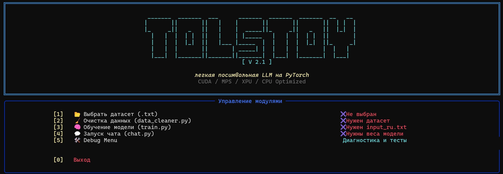
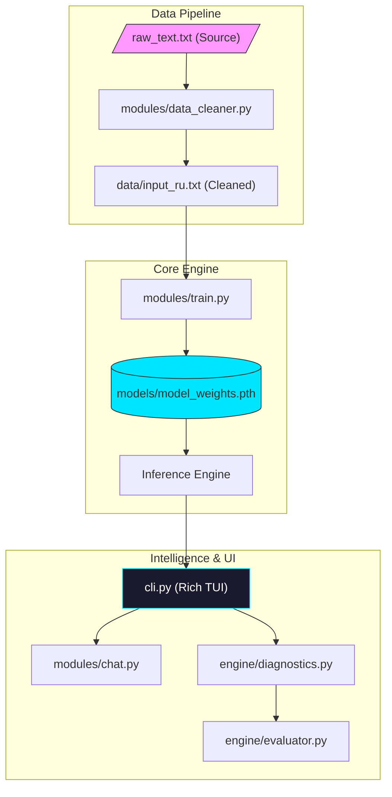

# 📚 Tolstoy AI v2.1 — Интеллектуальная Лингвистическая Студия



<p align="center">
  
  
  
  
</p>

---

## 🌟 О проекте

**Tolstoy AI** — это научно-исследовательская экосистема для глубокого обучения и лингвистического анализа языковых моделей. Проект сфокусирован на воссоздании уникального стиля, синтаксической сложности и семантической глубины русской классической литературы (на примере Л.Н. Толстого).

В основе системы лежит **SimpleLLM** — легковесный Decoder-only Transformer, оптимизированный для работы на широком спектре оборудования: от мощных серверных GPU до потребительских ноутбуков.

> [!TIP]
> Версия 2.1 вводит алгоритм "Собиратель промптов" (Prompt Gatherer) и расширенный лингвистический аудит, позволяющий оценивать качество генерации по 100-балльной шкале.

---

## 💎 Ключевые возможности

### 🧠 Когнитивное ядро (SimpleLLM)
- **Decoder-only Transformer**: Классическая архитектура с Multi-Head Attention.
- **Character-based**: Посимвольное обучение позволяет модели улавливать тончайшие нюансы пунктуации и ритмики.
- **Hardware Agnostic**: Автоматическое переключение между CUDA (NVIDIA), MPS (Apple Silicon), XPU (Intel Arc) и оптимизированным CPU.

### 📊 Лингвистический аудит
- **Heuristic Syntax Engine**: Собственный движок для распознавания частей речи и синтаксических паттернов.
- **Метрики качества**: Оценка TTR (Lexical Diversity), анализ сложности предложений и выявление "галлюцинаций".
- **Диагностика весов**: Визуализация распределения параметров и "здоровья" слоев.

### 🎨 Премиальный TUI (Rich Interface)
- **Interactive CLI**: Удобный пульт управления всеми модулями через `cli.py`.
- **Дашборды**: Графики обучения и системного мониторинга в реальном времени.

---

## 🏗 Архитектура системы



---

## 📁 Структура проекта

*   📂 **`core/`** — Логика модели (`model.py`), конфигурация (`config.py`) и базовые утилиты.
*   📂 **`modules/`** — Функциональные блоки: обучение, очистка данных и чат-интерфейс.
*   📂 **`engine/`** — Аналитический движок: диагностика железа и лингвистическая оценка.
*   📂 **`docs_2.1/`** — Подробная техническая документация и руководства.
*   📂 **`assets/`** — Визуальные материалы и промо-контент.

---

## 🚀 Быстрый старт

### 1. Окружение
```bash
pip install -r requirements.txt
```

### 2. Запуск
```bash
python cli.py
```

### 3. Рабочий процесс
1. **Подготовка**: Поместите текст в корень. В меню выберите `[1]` и `[2]`.
2. **Обучение**: Выберите `[3]`. Модель сама определит ваше железо и начнет процесс.
3. **Общение**: Выберите `[4]` для запуска интерактивного чата.
4. **Аудит**: В меню `[5]` проверьте, насколько хорошо модель усвоила правила русского языка.

---

## 📚 Документация

Для глубокого погружения изучите наши гайды:
- [📘 Спецификация модели SimpleLLM](docs_2.1/MODEL.md)
- [📗 Подготовка идеального датасета](docs_2.1/DATASET.md)
- [📙 Мастерство гиперпараметров](docs_2.1/tutorials/HYPERPARAMETERS.md)
- [🔍 Лингвистический дебаггинг](docs_2.1/tutorials/DEBUG_AND_EVALUATION.md)

---

## 📜 Лицензия

Проект выпускается под лицензией **MIT**. Полный текст доступен в файле [LICENSE](LICENSE).

<p align="center">
  <sub>Tolstoy AI Project • 2026 • Интеллектуальный анализ русской классики</sub>
</p>