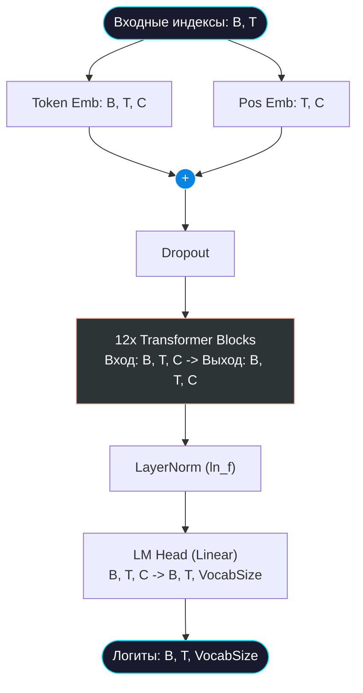

# 🧠 Архитектура Модели

> [!TIP]
> В данном разделе представлен подробный обзор архитектуры нейросети Tolstoy. Модель построена на базе классического Transformer (Decoder-only) с использованием посимвольной токенизации.

## 📋 Оглавление
- [Основные принципы](#основные-принципы)
- [Почему Transformer?](#почему-transformer)
- [Гиперпараметры](#гиперпараметры)
- [Структура Transformer](#структура-transformer)
- [Инициализация весов](#инициализация-весов)
- [Диаграмма потоков тензоров](#диаграмма-потоков-тензоров)

## Основные принципы
Модель Tolstoy представляет собой **Causal Decoder-only Transformer**. Это означает, что она обучается предсказывать следующий символ в последовательности, основываясь исключительно на предыдущих символах контекста.

Основные особенности:
- **Character-level токенизация**: Модель работает напрямую с символами, а не со словами или BPE-токенами. Это снижает размерность слоя эмбеддингов, но требует более глубокой архитектуры для выявления сложных словарных зависимостей.
- **Scaled Dot-Product Attention**: Использование оптимизированного механизма внимания из `torch.nn.functional` (`F.scaled_dot_product_attention`), который автоматически выбирает наилучшую реализацию (FlashAttention, Memory-Efficient Attention) в зависимости от железа.
- **Pre-LayerNorm**: Нормализация применяется перед блоками внимания и полносвязными слоями, что повышает стабильность обучения глубоких сетей (предотвращает взрыв градиентов).

## Почему Transformer?
В отличие от рекуррентных нейросетей (RNN, LSTM), Transformer:
1. Не имеет рекуррентной зависимости во времени, что позволяет обрабатывать всю входную последовательность параллельно.
2. Не страдает от забывания долгосрочного контекста благодаря механизму Self-Attention, который устанавливает прямые связи между любыми токенами в пределах `block_size`.

## Гиперпараметры
Все настройки модели хранятся в классе конфигурации (обычно `Config` в `config.py`). Базовые параметры:

| Параметр | Значение | Описание |
| :--- | :--- | :--- |
| `block_size` | 256 | Максимальная длина контекста. Определяет, насколько "далеко в прошлое" может смотреть модель. |
| `n_embd` | 768 | Размерность скрытого состояния (Embedding dimension). |
| `n_head` | 12 | Количество голов в механизме Multi-Head Attention. Определяет число параллельных проекций Q, K, V. |
| `n_layer` | 12 | Количество последовательных слоев Transformer Block. |
| `dropout` | 0.2 | Вероятность зануления нейронов для предотвращения переобучения. |

## Структура Transformer
Модель состоит из следующих ключевых компонентов:
1. **Token Embedding Layer**: Матрица размера `[vocab_size, n_embd]`, конвертирующая индексы токенов в плотные векторы.
2. **Position Embedding Layer**: Матрица размера `[block_size, n_embd]`, добавляющая информацию о позиции токена. В нашей модели используются обучаемые абсолютные позиционные эмбеддинги.
3. **Transformer Blocks**: Стек из 12 идентичных блоков. Каждый блок содержит:
   - Causal Multi-Head Self-Attention.
   - Position-wise Feed-Forward Network (FFN).
   - Layer Normalization и Residual Connections.
4. **Language Model Head**: Финальный линейный слой размера `[n_embd, vocab_size]`, проецирующий скрытое состояние обратно в вероятности токенов словаря.

## Инициализация весов
Для стабильного старта обучения критически важна правильная инициализация:
- Линейные слои и эмбеддинги инициализируются нормальным распределением со средним $0$ и стандартным отклонением $0.02$.
- Веса проекций, находящихся перед остаточными связями (residual pathways), масштабируются с коэффициентом $\frac{1}{\sqrt{2 \cdot n\_layer}}$. Это предотвращает рост дисперсии активаций по мере углубления сети.

## Диаграмма потоков тензоров

*(где B - размер батча, T - длина контекста, C - размерность n_embd)*

## Глоссарий
| Термин | Описание |
| :--- | :--- |
| **Logits** | Ненормированные предсказания модели до применения Softmax. |
| **Embedding** | Векторное представление дискретного объекта (символа). |
| **Residual Connection** | Остаточная связь ($x + layer(x)$), позволяющая градиентам легче проходить сквозь глубокую сеть при Backpropagation. |
| **Causal** | Причинный. Модель не имеет доступа к будущим токенам в процессе вычисления текущего. |

  <a href="DATASET.md">Далее: Подготовка данных →</a> 
  Tolstoy LLM • Documentation • 2024

