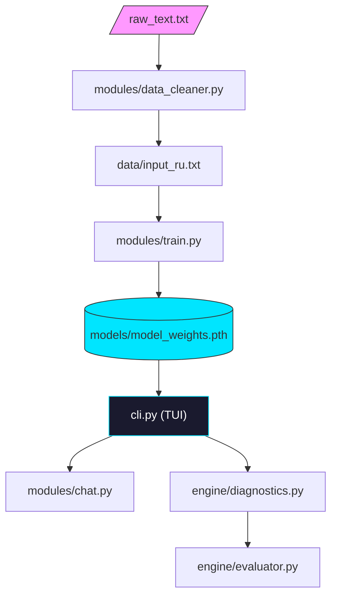

# 📚 Tolstoy AI (v2.1)


<p align="center">
  
  
  
  
</p>

---

**Tolstoy AI** — это высокотехнологичная экосистема для обучения и глубокого лингвистического анализа языковых моделей (LLM). Проект специализируется на посимвольной генерации текстов, имитирующих сложный синтаксис и глубокую семантику классической русской литературы.

> [!IMPORTANT]
> Версия 2.1 получила полностью переработанную архитектуру папок, улучшенный эвристический движок и систему семантического сбора промптов.

---

## 💎 Ключевые особенности

*   **⚡️ Оптимизированное ядро**: `SimpleLLM` — компактный Transformer, работающий даже на "домашнем" железе.
*   **🎭 Стилистическая точность**: Специальные эвристики для распознавания паттернов Толстого (двусоставные предложения, атрибутивные конструкции, сложные связки).
*   **📊 Лингвистический аудит**: Автоматическая оценка качества генерации с расчетом TTR (лексического разнообразия) и выявлением "мусорных" конструкций.
*   **🏗 Модульная архитектура**: Чистая структура проекта с разделением на ядро, модули обучения и движок анализа.
*   **🎨 Rich Terminal UI**: Премиальный интерфейс управления через `cli.py`.

---

## 📁 Структура проекта

Теперь проект организован максимально прозрачно:

*   📂 **`core/`** — Сердце системы: модель, конфиг и базовые утилиты.
*   📂 **`modules/`** — Рабочие лошадки: обучение (`train.py`), чат (`chat.py`) и очистка данных.
*   📂 **`engine/`** — Интеллект: лингвистический аудит и диагностика.
*   📂 **`models/`** — Хранилище обученных весов и словарей.
*   📂 **`data/`** — Исходные тексты и системные логи.

---

## 🛠 Быстрый старт

### 1. Установка зависимостей
```bash
pip install -r requirements.txt
```

### 2. Запуск пульта управления
```bash
python cli.py
```

### 3. Рабочий процесс
1.  **Data**: Поместите текст для обучения в `raw_text.txt` в корне.
2.  **Clean**: Запустите `[2] Подготовка данных`. Результат попадет в `data/input_ru.txt`.
3.  **Train**: Запустите `[3] Обучение`. Веса сохранятся в `models/`.
4.  **Audit**: Проверьте качество модели в меню `[5] Debug & Аналитика`.

---

## 🏗 Архитектура данных



---

## 📖 Подробные руководства

*   [📘 Архитектура SimpleLLM](docs_2.1/MODEL.md)
*   [📗 Подготовка данных](docs_2.1/DATASET.md)
*   [📙 Оптимизация обучения](docs_2.1/TRAINING.md)
*   [🔍 Лингвистический аудит](docs_2.1/tutorials/DEBUG_AND_EVALUATION.md)

---

## 📜 Лицензия
Проект распространяется под лицензией **MIT**.

<p align="center">
  <sub>Tolstoy AI • 2026 • Интеллектуальный анализ русской классики</sub>
</p>