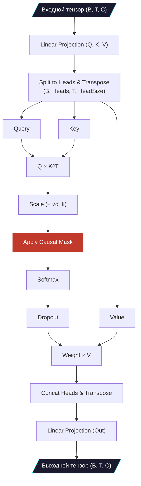

# ⚡ Механизм Внимания (Attention)

> [!TIP]
> Механизм Self-Attention (Само-внимание) — это алгоритм, который позволяет модели "взвешивать" важность каждого слова (токена) в контексте других слов. Это "сердце" архитектуры Transformer.

## 📋 Оглавление
- [Математика Attention](#математика-attention)
- [Causal Self-Attention](#causal-self-attention)
- [Маскировка (Masking)](#маскировка-masking)
- [Multi-Head структура](#multi-head-структура)
- [Масштабирование (Scaling)](#масштабирование-scaling)

## Математика Attention
Суть механизма внимания описывается одной классической формулой:

$$ \text{Attention}(Q, K, V) = \text{softmax}\left(\frac{QK^T}{\sqrt{d_k}}\right)V $$

Где:
- **$Q$ (Query - Запрос)**: То, что текущий токен "ищет" в контексте.
- **$K$ (Key - Ключ)**: То, что каждый токен "предлагает" или "содержит".
- **$V$ (Value - Значение)**: Сама информация, которая будет извлечена, если $Q$ и $K$ совпадут.

**Простыми словами:** Каждый токен создает свой запрос и ключ. Затем запросы всех токенов умножаются на ключи всех токенов ($QK^T$). Это дает матрицу "внимания", где каждая ячейка показывает, насколько один токен важен для другого.

## Causal Self-Attention
В нашей модели используется **Causal (причинный или авторегрессионный)** механизм. Поскольку задача языковой модели — предсказывать будущее, токен на позиции $t$ **не должен** иметь доступа к токенам на позициях $t+1, t+2 \dots$ (заглядывать в будущее).

Для реализации причинности используется **нижнетреугольная маска**.

## Маскировка (Masking)
В PyTorch причинная маскировка реализована на низком уровне для максимальной скорости. В коде это достигается передачей параметра `is_causal=True` в функцию `F.scaled_dot_product_attention`.

```python
# Быстрая и оптимизированная реализация внимания в PyTorch 2.0+
y = F.scaled_dot_product_attention(
    q, k, v, 
    attn_mask=None,
    dropout_p=self.dropout if self.training else 0.0,
    is_causal=True # Автоматически применяет причинную маску
)
```

> [!NOTE]
> Как работает маска математически? Перед применением операции `softmax`, все значения матрицы $QK^T$, находящиеся выше главной диагонали (то есть соответствующие связям "текущий токен -> будущий токен"), заменяются на $-\infty$. Softmax превращает $-\infty$ в $0$, таким образом вес внимания к будущему становится строго нулевым.

## Multi-Head структура
Вместо одного большого механизма внимания, мы делим векторы признаков на `n_head` (в нашем случае 12) параллельных частей ("голов").

Зачем это нужно? Каждая голова может обучиться находить свои специфические закономерности. Например:
- Голова 1: Ищет ближайшие знаки пунктуации.
- Голова 2: Связывает местоимения с существительными.
- Голова 3: Следит за структурой абзацев.

```python
# Трансформация размерностей для Multi-Head Attention
# Из (Batch, Time, Channels) в (Batch, Heads, Time, Head_Size)
k = k.view(B, T, self.n_head, C // self.n_head).transpose(1, 2)
q = q.view(B, T, self.n_head, C // self.n_head).transpose(1, 2)
v = v.view(B, T, self.n_head, C // self.n_head).transpose(1, 2)
```
После вычисления внимания результаты всех голов снова склеиваются (через `transpose` и `view`) и пропускаются через финальный линейный слой проекции.

## Масштабирование (Scaling)
В формуле присутствует деление на $\sqrt{d_k}$ (корень из размера головы).
Если размерность векторов $Q$ и $K$ велика, их скалярное произведение может принимать очень большие значения. Это приводит к тому, что значения после `softmax` становятся близкими к $0$ или $1$, а градиенты (производные) стремятся к нулю (проблема затухания градиентов). Деление на $\sqrt{d_k}$ нормализует дисперсию и стабилизирует обучение.

## Диаграмма работы Attention



## Глоссарий
| Термин | Описание |
| :--- | :--- |
| **SDPA** | Scaled Dot-Product Attention — эффективная реализация внимания, включенная в ядро PyTorch. |
| **FlashAttention** | Аппаратно-оптимизированный алгоритм вычисления SDPA, который минимизирует обращения к медленной памяти (VRAM) GPU. |

<p align="center">
  <a href="SIMPLE_LLM.md">← Назад: SimpleLLM</a> | <a href="BLOCKS.md">Далее: Transformer Blocks →</a><br/>
  <sub>Tolstoy LLM • Documentation • 2024</sub>
</p>
