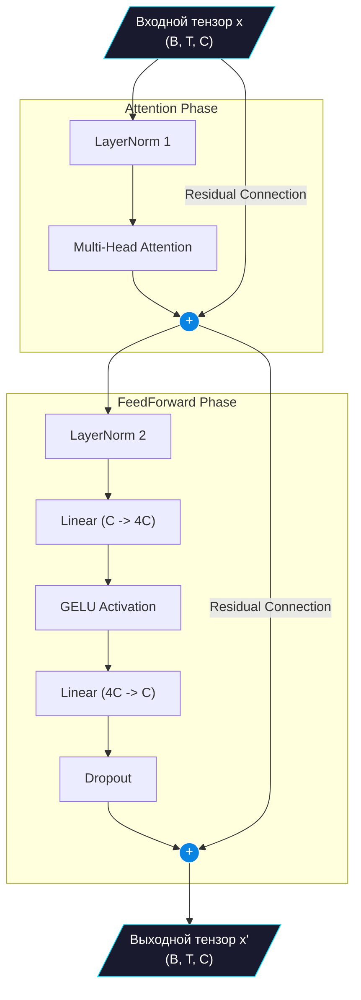

# 🧱 Transformer Blocks & FeedForward

> [!TIP]
> Transformer Block — это композитный строительный модуль модели, который объединяет механизм внимания (поиск взаимосвязей) и полносвязную нейросеть (нелинейная обработка признаков).

## 📋 Оглавление
- [Устройство блока (Block)](#устройство-блока-block)
- [LayerNorm и Pre-Norm](#layernorm-и-pre-norm)
- [FeedForward сеть (MLP)](#feedforward-сеть-mlp)
- [Остаточные связи (Residuals)](#остаточные-связи-residuals)
- [Схема движения данных](#схема-движения-данных)

## Устройство блока (Block)
Классический трансформер строится путем многократного повторения блоков `Block`. Каждый блок последовательно применяет слой внимания (Self-Attention) и слой нейросети прямого распространения (FeedForward).

```python
class Block(nn.Module):
    def __init__(self, n_embd, n_head, dropout):
        super().__init__()
        self.ln_1 = nn.LayerNorm(n_embd)
        self.attn = CausalSelfAttention(n_embd, n_head, dropout)
        self.ln_2 = nn.LayerNorm(n_embd)
        self.mlp = FeedForward(n_embd, dropout)

    def forward(self, x):
        # Внимание (связи между токенами)
        x = x + self.attn(self.ln_1(x))
        # FeedForward (осмысление полученных признаков)
        x = x + self.mlp(self.ln_2(x))
        return x
```

## LayerNorm и Pre-Norm
Для того чтобы сеть обучалась стабильно, распределение значений в тензорах не должно улетать в бесконечность или сжиматься в ноль по мере прохождения через десятки слоев. Эту задачу решает **Layer Normalization** (Нормализация по слоям).
Она вычисляет среднее значение и дисперсию вдоль размерности каналов (каждого токена отдельно) и нормализует вектор, после чего применяет обучаемые параметры `gamma` (масштабирование) и `beta` (сдвиг).

В оригинальном трансформере (2017 год) LayerNorm применялся *после* слоев внимания и FFWD (Post-Norm). В Tolstoy, как и во всех современных LLM (GPT-2, GPT-3, LLaMA), используется конфигурация **Pre-Norm**: нормализация применяется *до* слоев. Это доказанно улучшает стабильность градиентов без необходимости сложных расписаний `Learning Rate Warmup`.

## FeedForward сеть (MLP)
После того как механизм внимания собрал информацию из контекста, необходимо обработать эту информацию. В то время как Attention обеспечивает коммуникацию *между* токенами, FeedForward сеть обрабатывает каждый токен *независимо* от остальных.

**Архитектура FeedForward:**
1. **Расширение (Linear)**: Размерность признаков увеличивается в 4 раза (с `n_embd` до `4 * n_embd`). Это создает большое внутреннее пространство для сложных нелинейных трансформаций (своеобразная "память" сети).
2. **Активация (GELU)**: Применяется функция активации GELU (Gaussian Error Linear Unit). В отличие от ReLU, GELU имеет плавную кривую в отрицательной области, что помогает избегать проблемы "мертвых нейронов".
3. **Сжатие (Linear)**: Размерность возвращается обратно к `n_embd`.
4. **Регуляризация (Dropout)**: Случайное зануление связей для предотвращения переобучения.

```python
self.net = nn.Sequential(
    nn.Linear(n_embd, 4 * n_embd),
    nn.GELU(),
    nn.Linear(4 * n_embd, n_embd),
    nn.Dropout(dropout)
)
```

## Остаточные связи (Residuals)
Запись вида `x = x + layer(x)` называется остаточной связью (Residual Connection). 
Зачем она нужна? В очень глубоких сетях градиенты при обучении склонны затухать, проходя через множество нелинейных слоев. Остаточная связь создает своеобразный "шорткат" (короткий путь), по которому градиенты могут беспрепятственно течь от конца сети в самое её начало. Это позволяет обучать сети глубиной в сотни слоев.

## Схема движения данных



## Глоссарий
| Термин | Описание |
| :--- | :--- |
| **GELU** | Функция активации, плавно аппроксимирующая ReLU. $x \cdot \Phi(x)$, где $\Phi(x)$ — кумулятивная функция стандартного нормального распределения. |
| **Pre-Norm** | Архитектурное решение, при котором нормализация выполняется до трансформаций (Attention/MLP), а не после. |

<p align="center">
  <a href="ATTENTION.md">← Назад: Механизм внимания</a><br/>
  <sub>Tolstoy LLM • Documentation • 2024</sub>
</p>
