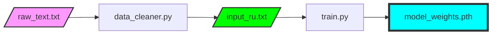

# 📚 Сбор и подготовка датасета

> [!NOTE]
> Качество генерации текста нейросетью напрямую зависит от качества и объема входных данных. Если вы загрузите "грязный" текст, модель будет генерировать мусор.

## 📋 Оглавление
1. [Где брать тексты (Источники)](#где-брать-тексты-источники)
2. [Рекомендации по размеру](#рекомендации-по-размеру)
3. [Тонкая настройка очистки](#тонкая-настройка-очистки)
4. [Многоязычность (RU/EN)](#многоязычность-ruen)
5. [Чек-лист перед обучением](#чек-лист-перед-обучением)
6. [Глоссарий](#глоссарий)

---

## 🌐 Где брать тексты (Источники)

Для обучения хорошей модели требуется качественная литература. Вот список проверенных ресурсов:

*   **Библиотека Максима Мошкова (Lib.ru)**: Огромный архив русской классики в формате `.txt`.
*   **Project Gutenberg**: Лучший источник для англоязычных текстов и мировой классики.
*   **Викитека (Wikisource)**: Удобно для поиска конкретных исторических документов.
*   **Kaggle Datasets**: Готовые корпуса текстов (например, "Все стихи Пушкина" или "Диалоги из фильмов").

---

## 📏 Рекомендации по размеру

Tolstoy AI — это посимвольная модель. Она учится на каждом знаке, включая пробелы и точки.

| Размер файла | Эпох до качества | Результат |
| :--- | :--- | :--- |
| **100 КБ - 500 КБ** | 2000 - 5000 | Модель выучит короткие фразы, но будет часто повторяться. |
| **1 МБ - 10 МБ** | 5000 - 10000 | **Золотая середина**. Хорошая грамматика, узнаваемый стиль автора. |
| **50 МБ - 200 МБ** | 20000+ | Высокий уровень "интеллекта". Требует мощной видеокарты (VRAM). |

---

## 🧹 Тонкая настройка очистки

Модуль `data_cleaner.py` можно настроить под себя. Если вы откроете файл, вы увидите блок регулярных выражений:

```python
# Пример кастомного правила в data_cleaner.py
text = re.sub(r'\[\d+\]', '', text) # Удаляет ссылки типа [1], [22]
text = re.sub(r'\n{3,}', '\n\n', text) # Убирает лишние пустые строки
```

> [!TIP]
> Если ваш текст содержит много технических пометок (например, "Глава 1", "Стр. 5"), лучше удалить их регулярными выражениями перед запуском очистки, чтобы модель не пыталась их генерировать в середине предложения.

---

## 🇷🇺 Многоязычность (RU/EN)

Tolstoy AI поддерживает смешанные датасеты. Однако есть нюансы:
1. **Размер словаря**: Если в тексте 50% русского и 50% английского, размер `vocab_size` вырастет. Это потребует небольшого увеличения `n_embd`.
2. **Доминирующий язык**: Модель будет лучше писать на том языке, которого в датасете больше. 
3. **Кодировка**: Обязательно сохраняйте файлы в **UTF-8**, иначе английские буквы сохранятся, а русские превратятся в "кракозябры".

---

## ✅ Чек-лист перед обучением

Проверьте эти пункты, прежде чем нажать **[3] Обучение**:

- [ ] Файл `raw_text.txt` существует в корне.
- [ ] Вы запустили **[2] Очистка данных** после последнего изменения текста.
- [ ] В файле `input_ru.txt` нет мусора (проверьте начало и конец файла).
- [ ] Размер словаря в консоли (Vocab Size) адекватен (обычно 80-120 символов).
- [ ] У вас достаточно места на диске для сохранения весов (`model_weights.pth` ~100-300 МБ).

---

## 🔄 Диаграмма потока данных



---

## Глоссарий

| Термин | Описание |
| :--- | :--- |
| **Корпус** | Собрание текстов, объединенных по какому-либо признаку (автор, эпоха, жанр). |
| **Regex** | Регулярные выражения — мощный инструмент для поиска и замены текста по шаблонам. |
| **Token** | В нашем случае 1 токен = 1 символ. |
| **Epoch** | Условный цикл, за который модель "прочитывает" весь ваш датасет один раз. |

<p align="center">
  <a href="QUICK_START.md">← Назад: Быстрый старт</a> | <a href="HYPERPARAMETERS.md">Далее: Гиперпараметры →</a><br/>
  <sub>Tolstoy AI • Documentation • 2024</sub>
</p>
