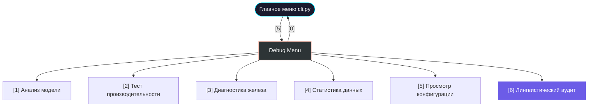
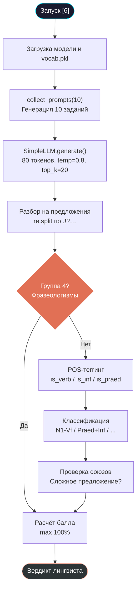

# 🔍 Debug режим и лингвистический анализ

> [!TIP]
> Качественная модель — это не только низкий Loss, но и структурно правильный текст. В Tolstoy AI встроен уникальный движок "лингвистического аудита", который оценивает синтаксис нейросети по 4 группам паттернов русского языка.

## 📋 Оглавление
1. [Философия диагностики](#философия-диагностики)
2. [Навигация по Debug Menu](#навигация-по-debug-menu)
3. [Пункт 1 — Анализ модели](#пункт-1--анализ-модели)
4. [Пункт 2 — Тест производительности](#пункт-2--тест-производительности)
5. [Пункт 3 — Диагностика железа](#пункт-3--диагностика-железа)
6. [Пункт 4 — Статистика данных](#пункт-4--статистика-данных)
7. [Пункт 5 — Просмотр конфигурации](#пункт-5--просмотр-конфигурации)
8. [Пункт 6 — Лингвистический аудит](#пункт-6--лингвистический-аудит)
9. [Алгоритм «Собиратель промпта»](#алгоритм-собиратель-промпта)
10. [HeuristicSyntaxEngine — движок анализа](#heuristicsyntaxengine--движок-анализа)
11. [Система скоринга](#система-скоринга)
12. [Эволюция модели по итерациям](#эволюция-модели-по-итерациям)
13. [Диаграммы](#диаграммы)
14. [Глоссарий](#глоссарий)

---

## 🎯 Философия диагностики

Loss (функция потерь) показывает лишь числовую ошибку предсказания. Но модель с Loss = 1.2 может генерировать бессвязный набор слов, а модель с Loss = 1.5 — грамматически правильные предложения. Debug Menu решает эту проблему, предоставляя инструменты для **качественной** оценки модели.

**Когда использовать Debug Menu:**
- **До обучения**: Пункты [3], [4], [5] — проверить железо, данные и конфигурацию.
- **Во время обучения**: Пункт [1] — убедиться, что веса не "взорвались".
- **После обучения**: Пункты [2], [6] — замерить скорость и оценить качество текста.

---

## 🗺 Навигация по Debug Menu

В главном меню `cli.py` выберите пункт **[5] 🛠️ Debug Menu**. Откроется подменю с шестью инструментами:

| Пункт | Название | Модуль | Что делает |
| :---: | :--- | :--- | :--- |
| **[1]** | Анализ модели | `get_model_stats()` | Архитектура слоев, статистика весов (Mean/Std/Min/Max) |
| **[2]** | Тест производительности | `benchmark_inference()` | Замер tok/s, latency, cold start, VRAM |
| **[3]** | Диагностика железа | `get_device_info()` | Тип GPU, объём VRAM, dtype для autocast |
| **[4]** | Статистика данных | `get_data_stats()` | Размер корпуса, vocab_size, Top-10 символов |
| **[5]** | Просмотр конфигурации | `Config.to_dict()` | Все параметры из `config.py` |
| **[6]** | Лингвистический аудит | `evaluate_generation_quality()` | Глубокий синтаксический тест с вердиктом |

---

## 📊 Пункт [1] — Анализ модели

Функция `model_analysis()` создаёт экземпляр `SimpleLLM`, загружает веса из `model_weights.pth` и вызывает `get_model_stats()`.

**Выходная таблица содержит колонки:**

| Колонка | Описание | Здоровые значения |
| :--- | :--- | :--- |
| **Layer Name** | Полное имя параметра (например, `blocks.0.attn.c_attn.weight`) | — |
| **Shape** | Размерность тензора (например, `[768, 2304]`) | — |
| **Params** | Количество параметров в слое | — |
| **Mean** | Среднее значение весов | Близко к **0.0** (±0.01) |
| **Std** | Стандартное отклонение | **0.01 – 0.1** для линейных слоев |
| **Min / Max** | Экстремальные значения | Не должны превышать ±5.0 |

> [!WARNING]
> Если **Std > 1.0** или **Max > 10.0** — это признак "взрыва градиентов". Уменьшите `learning_rate` в `config.py` или проверьте, что Gradient Clipping активен в `train.py`.

> [!NOTE]
> Если веса не загружены (файл `model_weights.pth` отсутствует), таблица покажет только архитектуру без статистики. Общее число параметров модели при стандартной конфигурации (12 слоев, 768 embd) составляет около **85 миллионов**.

---

## 🚀 Пункт [2] — Тест производительности

Функция `performance_bench()` использует `benchmark_inference()` из `utils.py`. Методология:

1. **Cold Start**: Генерация 5 токенов "на холодную" (первый вызов, загрузка ядер GPU).
2. **Warmup**: Один прогон из 50 токенов для прогрева кешей.
3. **Benchmark**: 10 итераций по 50 токенов с замером времени каждой.

**Выходные метрики:**

| Метрика | Что значит | Пример |
| :--- | :--- | :--- |
| **Tokens per Second** | Скорость генерации символов | 350.00 tok/s |
| **Latency per Token** | Время на один символ | 2.86 ms |
| **Cold Start** | Задержка первого вызова | 1200 ms |
| **Avg Batch Time** | Среднее время на батч из 50 токенов | 143 ms |
| **VRAM Allocated** | Текущее потребление видеопамяти | 650 MB |
| **VRAM Peak** | Пиковое потребление | 820 MB |

**Эталонные значения:**

| Устройство | tok/s | Latency | Рекомендация |
| :--- | :--- | :--- | :--- |
| CPU (i5/i7) | 5 – 20 | 50 – 200 ms | Только тесты |
| Apple M1/M2 (MPS) | 50 – 150 | 7 – 20 ms | Средние модели |
| RTX 3060 (12GB) | 200 – 500 | 2 – 5 ms | Полноценное обучение |
| RTX 4090 (24GB) | 500 – 1200 | 0.8 – 2 ms | Глубокие сети |

---

## 💻 Пункт [3] — Диагностика железа

Функция `hardware_diagnostics()` вызывает `get_device_info()`. Логика определения устройства:

1. `torch.cuda.is_available()` → **NVIDIA CUDA**
2. `torch.backends.mps.is_available()` → **Apple MPS**
3. `torch.xpu.is_available()` → **Intel XPU**
4. Иначе → **CPU** (автоматически `torch.set_num_threads(os.cpu_count())`)

**Выходные поля:**
- **Detected Device**: `cuda`, `mps`, `xpu` или `cpu`
- **Device Type**: Совпадает с Device (используется для `torch.autocast`)
- **Autocast Dtype**: `bfloat16` (CUDA с поддержкой), `float16` (MPS/старые CUDA) или `bfloat16` (CPU)
- **Name**: Название GPU (например, "NVIDIA GeForce RTX 3060")
- **Memory Total / Free**: Объём и свободная VRAM в ГБ

---

## 📈 Пункт [4] — Статистика данных

Функция `data_stats_view()` вызывает `get_data_stats()` для файла `input_ru.txt`.

**Что показывает:**
- **Total Characters**: Общее число символов в корпусе.
- **Unique Tokens (Vocab)**: Размер словаря. Типично **80–120** для русского текста.
- **Top 10 Characters**: Десять самых частых символов с частотой.

**На что обратить внимание:**
- Пробел (`' '`) и буква `о` обычно в тройке лидеров.
- Если в топе есть `\x00`, `\ufeff` или подобные — в данных мусор, нужна повторная очистка.
- Если `vocab_size > 200` — возможно, в тексте есть иероглифы или эмодзи.

---

## 📋 Пункт [5] — Просмотр конфигурации

Функция `config_view()` вызывает `Config.to_dict()` и выводит все параметры:

| Параметр | Значение | Категория |
| :--- | :--- | :--- |
| `input_path` | `input_ru.txt` | Пути |
| `vocab_path` | `vocab.pkl` | Пути |
| `weights_path` | `model_weights.pth` | Пути |
| `block_size` | 256 | Архитектура |
| `n_embd` | 768 | Архитектура |
| `n_head` | 12 | Архитектура |
| `n_layer` | 12 | Архитектура |
| `dropout` | 0.2 | Архитектура |
| `batch_size` | 16 | Обучение |
| `gradient_accumulation_steps` | 2 | Обучение |
| `max_iters` | 6000 | Обучение |
| `eval_interval` | 100 | Обучение |
| `learning_rate` | 6e-4 | Обучение |
| `min_lr` | 6e-5 | Обучение |
| `warmup_iters` | 200 | Обучение |
| `seed` | 42 | Железо |

---

## 🧠 Пункт [6] — Лингвистический аудит

Это самый продвинутый инструмент. Функция `generation_quality_test()` выполняет полный цикл:

1. Загружает модель и словарь (`vocab.pkl`).
2. Генерирует 10 тестовых промптов через алгоритм **«Собиратель промпта»**.
3. Для каждого промпта модель генерирует продолжение (80 токенов, temperature=0.8, top_k=20).
4. Движок `HeuristicSyntaxEngine` анализирует результат.
5. Выводится таблица с баллами и финальный **«Вердикт лингвиста»**.

**Выходная таблица содержит:**
- **Промпт / Результат**: Задание и ответ модели.
- **Сложность**: Три числа через `/` — запятые / тире / союзы (синий / фиолетовый / жёлтый).
- **Синтаксис (Паттерны)**: Найденные грамматические конструкции.
- **Балл**: Оценка от 0% до 100%.

---

## 🎲 Алгоритм «Собиратель промпта»

Функция `collect_prompts()` генерирует 10 грамматически правильных русских предложений из базы слов. Она использует **10 шаблонов**:

| № | Шаблон | Пример |
| :---: | :--- | :--- |
| 1 | `{наречие} в {прил.} {место} {персонаж} {глаг.}` | "Тихо в тёмном кабинете Князь сидел" |
| 2 | `{время} {персонаж} {наречие} {глаг.движ.} в {место}` | "Утро Офицер медленно шёл в город" |
| 3 | `В {прил.} {место} {персонаж} {наречие} {глаг.} {предмет}` | "В старом доме Граф тихо читал книгу" |
| 4 | `{персонаж} {глаг.} {прил.} {предмет} и {наречие} {глаг.}` | "Андрей взял тёмную шпагу и грустно смотрел" |
| 5 | `Когда {персонаж} {глаг.} через {место}, он {глаг.} {предмет}` | "Когда Солдат шёл через поле, он заметил ружьё" |
| 6 | `{наречие} {персонаж} {глаг.} у {предмет.род.}` | "Спокойно Старик стоял у окна" |
| 7 | `{время} {наречие} {глаг.} {прил.} {персонаж}` | "Ночь внезапно бежал уставший Генерал" |
| 8 | `В {место} {глаг.} {прил.} {персонаж} и думал` | "В саду сидел мрачный Князь и думал" |
| 9 | `{перс.} {наречие} {глаг.} {предмет}, пока в {месте} {глаг.} {перс.2}` | "Граф тихо писал письмо, пока в зале ждал Слуга" |
| 10 | `{наречие} {перс.} {глаг.}, побежал в {место} и замолчал` | "Вдруг Андрей заметил, побежал в дом и замолчал" |

> [!NOTE]
> Все промпты используют грамматически корректные падежные формы прилагательных и существительных через словари `adj_forms`, `place_data` и `item_data`. Каждый промпт заканчивается запятой, чтобы спровоцировать модель на продолжение сложного предложения.

---

## ⚙️ HeuristicSyntaxEngine — движок анализа

Класс `HeuristicSyntaxEngine` из `evaluator.py` определяет грамматические конструкции русского языка **без внешних NLP-библиотек**, используя только регулярные выражения и эвристики.

### Методы определения частей речи

| Метод | Логика | Окончания |
| :--- | :--- | :--- |
| `is_verb()` | Поиск глагольных окончаний | `-ет`, `-ит`, `-ут`, `-ют`, `-л`, `-ла`, `-ться` и др. |
| `is_inf()` | Поиск окончаний инфинитива | `-ть`, `-ти`, `-чь` |
| `is_praed()` | Проверка по словарю предикативов | `холодно`, `жаль`, `надо`, `пора`, `можно`, `нельзя`... |

### Четыре прохода анализа

**Проход 1 — Группа 4 (Фразеологизмы)**:
Движок ищет идиоматические конструкции через RegEx с обратными ссылками:
- `(\w+) так \1` → Тождество ("день так день")
- `(\w+) как \1` → Обыденность
- `взял и \w+` → Внезапность ("взял и ушёл")
- `что за \w+` → Оценка ("что за человек!")
- `ну и \w+` → Оценка ("ну и дела!")

**Проход 2 — Определение типа предложения**:

| Условие | Паттерн | Пример |
| :--- | :--- | :--- |
| Субъект + глагол | `N1 - Vf (Двусоставное)` | "Князь сидел" |
| Субъект + предикатив | `N1 - Praed` | "Ему холодно" |
| Предикатив + инфинитив | `Praed + Inf (Безличное)` | "Надо идти" |
| Только инфинитив | `Inf (Независимый инфинитив)` | "Молчать!" |
| Глагол без субъекта | `V (Односоставное глагольное)` | "Смеркалось" |
| Субъект + тире | `N1 - Cop - N1 (Связка)` | "Москва — столица" |
| Только субъект | `N1 (Назывное)` | "Ночь. Улица." |

**Проход 3 — Сложность**:
Если в тексте найдены союзы (`и`, `а`, `но`, `что`, `когда`, `хотя`...), добавляется метка `Сложное (Союзная связь)`.

### Метрики сложности (`get_complexity_metrics`)
- **Запятые** (`,`): Показатель вложенности и перечислений.
- **Тире** (`—`, `-`): Признак авторской пунктуации и вводных конструкций.
- **Союзы**: Количество найденных союзов из словаря (12 штук).

---

## 📐 Система скоринга

Каждый промпт оценивается по формуле (максимум 100 баллов):

```
Балл = min(уникальные_паттерны × 15, 45)     // До 45 за разнообразие
     + min(знаки_сложности × 5, 25)           // До 25 за пунктуацию
     + 15 (если найден паттерн Группы 4)       // Бонус за идиомы
     + 15 (если текст заканчивается на .!?…)   // Бонус за завершённость
```

**Пример расчёта:**
Модель на промпт "В старом доме Граф тихо читал книгу," сгенерировала:
> "которую нашёл в библиотеке отца. Он долго сидел и думал."

- Паттерны: `N1 - Vf`, `Сложное` → 2 × 15 = **30**
- Сложность: 1 запятая + 0 тире + 1 союз ("и") = 2 × 5 = **10**
- Группа 4: нет → **0**
- Завершённость: заканчивается на `.` → **15**
- **Итого: 55%**

### Три вердикта лингвиста

| Вердикт | Баллы | Цвет | Описание |
| :--- | :--- | :--- | :--- |
| **Высокая структурная связность** | > 60% | 🟢 Зелёный | Модель строит сложные предложения с правильной пунктуацией |
| **Базовое понимание грамматики** | 30 – 60% | 🟡 Жёлтый | Простые конструкции, ошибки в запятых |
| **Низкая синтаксическая точность** | < 30% | 🔴 Красный | "Словесный салат", модель не выучила структуру языка |

---

## 📈 Эволюция модели по итерациям

Типичная динамика качества при обучении на корпусе ~10 МБ:

| Итерация | Loss | Аудит | Характер текста |
| :--- | :--- | :--- | :--- |
| **100** | ~3.5 | 0 – 5% | Случайные буквы: `ктмоваенн пр` |
| **500** | ~2.5 | 5 – 15% | Псевдослова: `привезано на домой` |
| **1000** | ~2.0 | 15 – 30% | Короткие фразы: `Он пришел. Она сказал.` |
| **3000** | ~1.5 | 30 – 60% | Грамматика: `Князь долго думал и решил` |
| **6000** | ~1.2 | 50 – 80%+ | Стиль автора: сложные предложения с правильными союзами |

> [!IMPORTANT]
> Если на итерации 3000+ аудит показывает < 20%, проверьте: (1) достаточный ли объём датасета, (2) не слишком ли высокий `dropout`, (3) не было ли прерывания обучения.

---

## 📊 Диаграммы

### Навигация по Debug Menu



### Пайплайн лингвистического аудита



---

## Глоссарий

| Метка | Термин | Описание |
| :--- | :--- | :--- |
| **N1** | Субъект | Существительное или местоимение в именительном падеже |
| **Vf** | Глагол (личная форма) | Спрягаемый глагол: "сидел", "идёт", "пишут" |
| **Inf** | Инфинитив | Начальная форма глагола: "писать", "идти", "беречь" |
| **Praed** | Предикатив | Слово категории состояния: "холодно", "надо", "пора" |
| **Cop** | Связка | Тире или глагол-связка: "Москва — столица" |
| **SDPA** | Scaled Dot-Product Attention | Оптимизированная реализация внимания в PyTorch |
| **tok/s** | Tokens per second | Скорость генерации символов в секунду |
| **VRAM** | Video RAM | Видеопамять GPU, основной ограничитель при обучении |
| **Cold Start** | Холодный старт | Задержка первого вызова из-за загрузки ядер GPU |
| **Heuristic** | Эвристика | Упрощённое правило для быстрой оценки без полного NLP-разбора |
| **POS-теггинг** | Определение части речи | Классификация слов по частям речи (глагол, существительное и т.д.) |
| **RegEx** | Регулярное выражение | Шаблон для поиска текстовых паттернов |

<p align="center">
  <a href="HYPERPARAMETERS.md">← Назад: Гиперпараметры</a> | <a href="QUICK_START.md">В начало: Быстрый старт</a><br/>
  <sub>Tolstoy AI • Documentation • 2024</sub>
</p>
