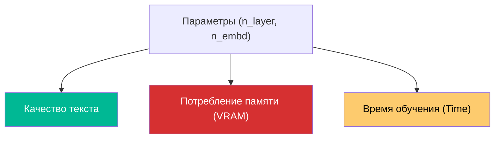

# ⚙️ Настройка гиперпараметров

> [!TIP]
> **Гиперпараметры** — это "ручки управления", которые определяют архитектуру мозга нейросети и то, как именно она будет учиться. В Tolstoy AI они находятся в файле `config.py`.

## 📋 Оглавление
1. [Разбор ключевых констант](#разбор-ключевых-констант)
2. [Золотые рецепты (Пресеты)](#золотые-рецепты-пресеты)
3. [Глубокое погружение: Learning Rate](#глубокое-погружение-learning-rate)
4. [Регуляризация (Dropout и Weight Decay)](#регуляризация-dropout-и-weight-decay)
5. [Расчет памяти (VRAM)](#расчет-памяти-vram)
6. [Глоссарий](#глоссарий)

---

## 🔍 Разбор ключевых констант

Все настройки хранятся в классе `Config` в файле `config.py`.

### 🏗 Архитектура модели
*   **`n_layer`**: Количество слоев Трансформера. Влияет на способность модели понимать сложные логические связи.
*   **`n_embd`**: Ширина сети. Чем больше, тем точнее модель описывает нюансы стиля, но тем тяжелее она становится.
*   **`block_size`**: Окно памяти. Если `block_size = 256`, модель видит только последние 256 символов.

---

## 🍳 Золотые рецепты (Пресеты)

Выберите пресет в зависимости от вашего железа:

| Пресет | Железо | n_layer | n_embd | batch_size |
| :--- | :--- | :--- | :--- | :--- |
| **"Минимальный"** | Обычный ноутбук (CPU) | 4 | 128 | 8 |
| **"Стандарт"** | GPU (4-6 ГБ VRAM) | 8 | 384 | 32 |
| **"Толстой"** | GPU (8-12 ГБ VRAM) | 12 | 768 | 64 |
| **"Максимум"** | GPU (24 ГБ VRAM) | 24 | 1024 | 128 |

---

## 🚄 Глубокое погружение: Learning Rate

`learning_rate` — это, пожалуй, самая важная цифра. Она определяет размер шага, который делает модель в сторону правильного ответа.

- **Слишком высокий ( > 1e-3)**: Модель будет "перепрыгивать" через правильное решение. Loss станет `NaN`.
- **Слишком низкий ( < 1e-5)**: Обучение будет идти вечность, и модель может застрять в "локальном минимуме" (выучить одну фразу и повторять её).

> [!IMPORTANT]
> Мы используем косинусное расписание (`Cosine Annealing`). Это значит, что в начале шаги большие, а к концу обучения они становятся микроскопическими для точной подстройки весов.

---

## 🛡 Регуляризация (Dropout и Weight Decay)

Чтобы модель не зазубривала текст (Overfitting), используются два механизма:
1. **`dropout` (0.1 - 0.2)**: Случайное "выключение" нейронов во время обучения. Это заставляет сеть искать общие правила языка, а не полагаться на конкретные связи.
2. **`weight_decay` (0.1)**: Штраф за слишком большие веса. Удерживает "мозг" модели в рамках, не давая отдельным параметрам стать слишком доминирующими.

---

## 📊 Расчет памяти (VRAM)

Потребление памяти растет линейно от количества слоев и **квадратично** от `block_size`.

Примерная формула:
`Memory ≈ (n_layer * n_head * block_size^2) * batch_size * 4 bytes`

Если вы получили ошибку `CUDA Out of Memory`:
1. Уменьшите `batch_size` (это не влияет на качество, только на скорость).
2. Если не помогло, уменьшите `block_size` до 128.
3. В крайнем случае снижайте `n_embd`.

---

## 📊 Диаграмма зависимостей

---

## Глоссарий

| Термин | Описание |
| :--- | :--- |
| **VRAM** | Видеопамять вашей видеокарты. |
| **Loss** | Ошибка модели. Чем она меньше, тем лучше модель предсказывает следующий символ. |
| **Convergence** | Сходимость — состояние, когда модель перестает улучшаться и Loss стабилизируется. |
| **Linear Layer** | Слой, выполняющий умножение весов на входные данные. |

  <a href="DATASET_GUIDE.md">← Назад: Сбор датасета</a> | <a href="DEBUG_AND_EVALUATION.md">Далее: Debug и анализ →</a> 
  Tolstoy AI • Documentation • 2024

