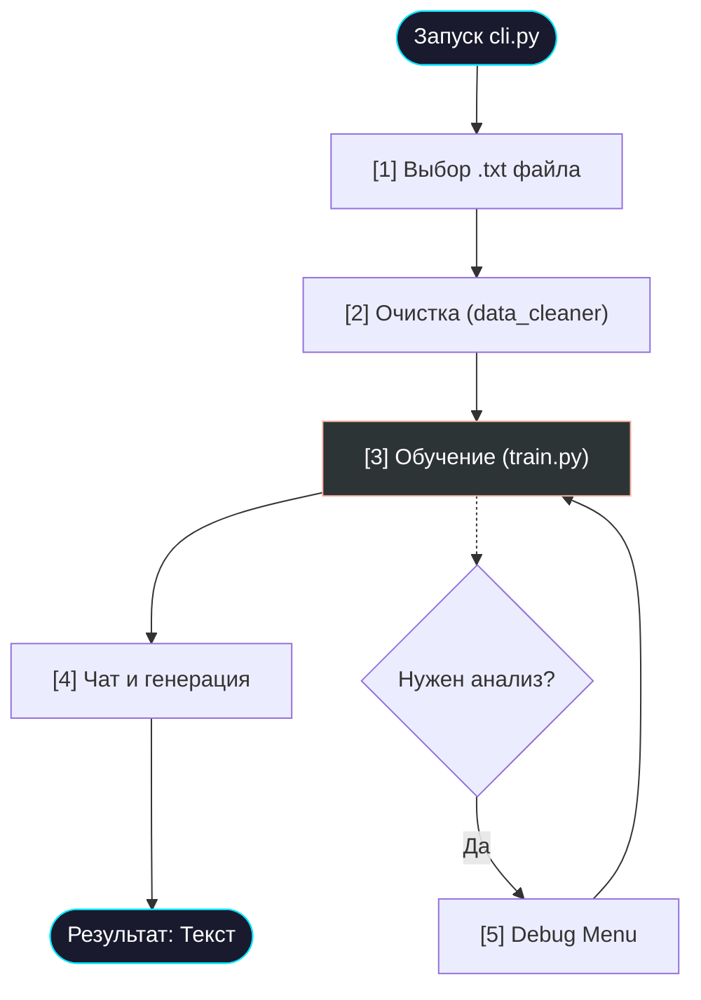

# 🚀 Быстрый старт в интерфейсе

> [!TIP]
> Проект Tolstoy AI оснащен удобным текстовым интерфейсом (TUI) на базе библиотеки `rich`. Это позволяет управлять полным циклом жизни нейросети — от подготовки данных до глубокого анализа весов — без написания кода.

## 📋 Оглавление
1. [Подготовка окружения](#подготовка-окружения)
2. [Запуск интерфейса](#запуск-интерфейса)
3. [Путь от данных до генерации](#путь-от-данных-до-генерации)
4. [Описание главного меню](#описание-главного-меню)
5. [Устранение неполадок (Troubleshooting)](#устранение-неполадок-troubleshooting)
6. [Диаграмма процесса](#диаграмма-процесса)
7. [Глоссарий](#глоссарий)

---

## 🛠 Подготовка окружения

Перед первым запуском крайне рекомендуется использовать виртуальное окружение, чтобы избежать конфликтов библиотек.

### Windows
```powershell
python -m venv venv
.\venv\Scripts\activate
pip install -r requirements.txt
```

### Linux / macOS
```bash
python3 -m venv venv
source venv/bin/activate
pip install -r requirements.txt
```

> [!IMPORTANT]
> Для работы на GPU NVIDIA убедитесь, что у вас установлены драйверы версии 520+ и соответствующая версия CUDA Toolkit.

---

## 🖥 Запуск интерфейса

После активации окружения запустите основной файл управления:

```bash
python cli.py
```

После запуска вы увидите стильное ASCII-лого и главную панель управления. В нижней части экрана отображаются индикаторы состояния:
- **RAW**: Наличие исходного текста.
- **DATA**: Готовность очищенного датасета.
- **MODEL**: Наличие обученных весов.

---

## 🛤 Путь от данных до генерации

Чтобы получить первую осмысленную генерацию текста, необходимо пройти четыре основных этапа:

1.  **Выбор датасета [1]**: Найдите любой текстовый файл в формате `.txt` в корневой папке проекта. Система скопирует его как `raw_text.txt`.
2.  **Очистка данных [2]**: Запустите `data_cleaner.py`. Скрипт удалит лишние символы, нормализует пунктуацию и создаст файл `input_ru.txt`. 
    - *Совет*: Если файл очень большой (>100МБ), очистка может занять несколько минут.
3.  **Обучение модели [3]**: Запустите процесс обучения. Вы увидите прогресс-бар и текущие значения Loss. 
    - *Важно*: Если вы прервали обучение (Ctrl+C), веса сохранятся, и вы сможете продолжить позже.
4.  **Запуск чата [4]**: Модель готова! Введите затравку (например, "В тот вечер князь..."), и нейросеть продолжит текст.

---

## 📋 Описание главного меню

В главном меню `cli.py` доступны следующие пункты:

*   **[1] 📂 Выбрать датасет**: Интерактивный список всех `.txt` файлов. Можно быстро переключаться между разными авторами.
*   **[2] 🧹 Очистка данных**: Удаление мусора, нормализация кавычек и дефисов. Создает `input_ru.txt` и `vocab.pkl`.
*   **[3] 🧠 Обучение модели**: Точка входа в `train.py`. Можно настроить количество итераций перед стартом.
*   **[4] 💬 Запуск чата**: Генерация в реальном времени. Параметр **Temperature** (0.1 - 1.5) меняет стиль от сухого повторения до полного безумия.
*   **[5] 🛠️ Debug Menu**: Инструменты анализа железа и "мозгов" модели.

---

## 🆘 Устранение неполадок (Troubleshooting)

| Проблема | Решение |
| :--- | :--- |
| **"ModuleNotFoundError"** | Вы забыли активировать `venv` или запустить `pip install`. |
| **"CUDA Out of Memory"** | Снизьте `batch_size` или `n_embd` в `config.py`. |
| **Квадратики вместо текста** | Проверьте, что ваш терминал поддерживает UTF-8 (рекомендуется Windows Terminal или VS Code). |
| **Loss = NaN** | Слишком высокий `learning_rate`. Попробуйте уменьшить его в два раза. |

---

## 📊 Диаграмма процесса



---

## Глоссарий

| Термин | Описание |
| :--- | :--- |
| **TUI** | Text User Interface — интерфейс пользователя внутри терминала. |
| **Промпт** | Начальный текст, который вы вводите для продолжения. |
| **Venv** | Изолированная папка с библиотеками Python для конкретного проекта. |
| **CLI** | Command Line Interface — управление через ввод команд в консоли. |

<p align="center">
  <a href="DATASET_GUIDE.md">Далее: Сбор датасета →</a><br/>
  <sub>Tolstoy AI • Documentation • 2024</sub>
</p>
